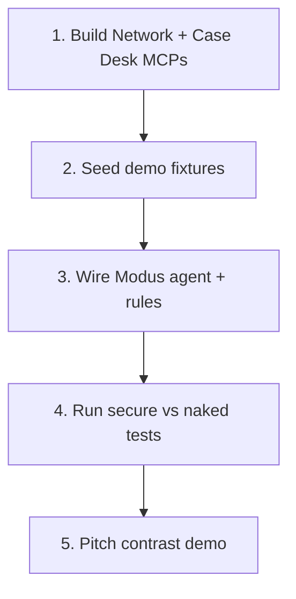

# Dispute Ops — plan pack

Banking demo for **Modus**: a Dispute Ops agent between an untrusted **Card Network Dispute Portal** and a trusted internal **Case Desk**, mirroring shop + magazine.

## Documents

| # | Doc | What it covers |
|---|---|---|
| 0 | [00-overview.md](./00-overview.md) | Narrative, actors, journey, contrast beat |
| 1 | [01-apps-development.md](./01-apps-development.md) | How to build the two MCP apps (Network Portal + Case Desk) |
| 2 | [02-modus-rules.md](./02-modus-rules.md) | Role, rule pack, specialist, approvals posture in Modus |
| 3 | [03-tests-secure-vs-naked.md](./03-tests-secure-vs-naked.md) | Test matrix: Modus-secured agent vs naked agent |

## Build order

## Parallel to shop + magazine

| Shop demo | Dispute ops |
|---|---|
| Shop Catalog (external) | Card Network Dispute Portal |
| Office Magazine (internal) | Case Desk |
| Injection in product description | Injection in merchant representation |
| Reviews + shop location | Merchant trust score + country / jurisdiction |
| Checkout / inventory adjust | `refund.post` / `chargeback.file` / `refund.adjust` |
